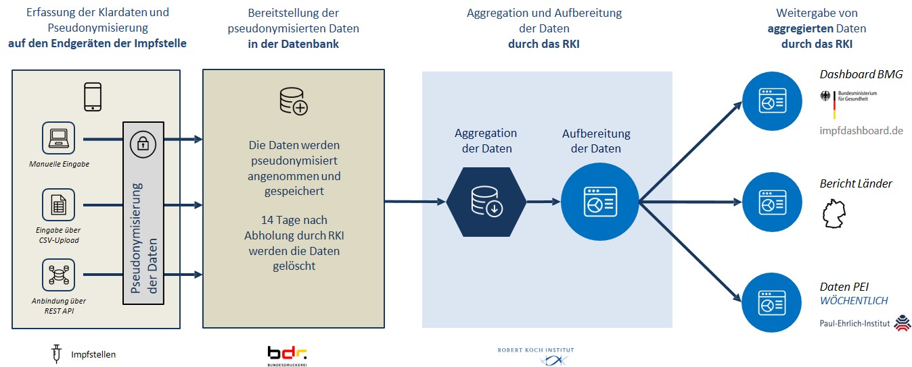

Datensatzdokumentation

# COVID-19-Impfungen in Deutschland

[Robert Koch-Institut](https://rki.de) | RKI  
Nordufer 20  
13353 Berlin  

**FG 33 |  Impfprävention**  
[Anette Siedler](https://orcid.org/0000-0002-6359-1018) (Fachliche Leitung)  
[Thorsten Rieck](https://orcid.org/0000-0002-8799-8744) (Datenanalyse)  
[Annika Steffen](https://orcid.org/0000-0003-4072-9245) (Datenanalyse)  
Nita Perumal (Datenanalyse)  

**FG 31 | Infektionsepidemiologische Fach-IT und Anwendungsentwicklung**  
[Lei Mao](https://orcid.org/0000-0002-8356-755X) (Projektleitung)  
[Hermann Claus](https://orcid.org/0000-0002-0120-1846) (Technische Leitung)  
Constantin Fischer (Datenmanagement)  
Sven Schröder (Datenmanagement)  

**MF 4 | Forschungsdatenmanagement**  
[Hannes Wuensche](https://orcid.org/0000-0002-8837-0326) (Datenkuration)  

---

Robert Koch-Institut (2021): COVID-19-Impfungen in Deutschland, Berlin: Zenodo. DOI:[10.5281/zenodo.5126652](http://doi.org/10.5281/zenodo.5126652).  

Der Datensatz "COVID-19-Impfungen in Deutschland" ist lizenziert unter der [Creative Commons Namensnennung 4.0 International Public License |](https://creativecommons.org/licenses/by/4.0/deed.de) <a rel="license" href="https://creativecommons.org/licenses/by-sa/4.0/legalcode.de">CC-BY 4.0 International</a>

## Informationen zum Datensatz und Entstehungskontext  

Die COVID-19-Impfung kann einen Wendepunkt in der Kontrolle der COVID-19-Pandemie darstellen und erfährt daher hohes Maß an öffentlicher Aufmerksamkeit. Einführung und Umsetzung der COVID-19-Impfung gehen mit besonderen Herausforderungen einher, die bei der Impfdatenerfassung zu berücksichtigen sind. 

In diesem Kontext ist es Ziel des Projekts "Digitales Impfquoten-Monitoring" (DIM), tagesaktuell und bundesweit die Impfquote zu erfassen und folgend aufbereitet darzustellen, um zeitnah den Verlauf der COVID-19-Impfkampagne zu analysieren, bei Bedarf nachzusteuern und logistische bzw. organisatorische Konsequenzen zu ziehen.  

Ein Hauptbestandteil des DIM-Projekts ist die DIM-Anwendung, eine Web-basierte Softwarelösung zur Erfassung der Impfquote der Bevölkerung gegen SARS-CoV2 auf Grundlage der [Coronavirus-Impfverordnung (CoronaImpfV)](https://www.bundesgesundheitsministerium.de/service/gesetze-und-verordnungen.html).  

Die DIM-Anwendung besteht aus Eingabemasken/Dialogen (Frontend) und dahinter liegenden Datenbanksystem (Backend). Autorisiertes Personal der stationären Impfzentren und mobile Impfteams können über die Web-Anwendung die Impfdatensätze zur COVID-19-Impfung eingeben und über eine gesicherte Internetverbindung pseudonymisiert an die Bundesdruckerei übermitteln. Im Auftrag des RKI werden die Daten von der Bundesdruckerei zwischengespeichert und vom RKI mehrmals täglich abgerufen. Alternativ zur direkten Eingabe können Daten in einem vorgegebenen csv-Datenformat durch die DIM-Web-Anwendung übermittelt werden (csv-Upload Schnittstelle). Als dritte Möglichkeit können Datensätze über eine REST-API Schnittstelle aus einem Fremdsystem an in das Datenbanksystem übertragen werden. Die nachfolgende Darstellung zeigt schematisch den Datenfluss von Erfassung der Daten in den Impfzentren bis hin zur Weitergabe der aggregierten Daten durch das RKI.

### Projektbeteiligte und Rollenbesetzung  

An dem Projekt "Digitales Impfquoten-Monitoring" sind verschiedene Stakeholder beteiligt. Projektauftraggeber ist das [Bundesministerium für Gesundheit (BMG)](https://www.bundesgesundheitsministerium.de/). Das [Robert Koch-Institut](https://rki.de) übernimmt die Projektleitung. Die [Bundesdruckerei (BDr)](https://www.bundesdruckerei.de/) ist zuständig für die technische Entwicklung und den Betrieb der Web-Anwendung. [Accenture GmbH (ACN)](https://www.accenture.com/) unterstützt das RKI bei der Konzeption, der Planung, Dokumentation und der Rolloutkoordination. Projektzeitraum ist vom 01.11.2020 bis 30.11.2022.  

**Projektleitung** 
- Anette Siedler | [Fachgebiet 33](https://www.rki.de/DE/Content/Institut/OrgEinheiten/Abt3/FG33/FG33_node.html)  
- Lei Mao und Hermann Claus  | [Fachgebiet 31](https://www.rki.de/DE/Content/Institut/OrgEinheiten/Abt3/FG31/FG31_node.html)  

Die zugrundeliegenden Daten werden über die Bundesdruckerei an das Robert Koch-Institut (RKI) übermittelt. Die Verarbeitung und Aufbereitung der vorliegenden Rohdaten erfolgt durch das [Fachgebiet 31 | Infektionsepidemiologische Fach-IT und Anwendungsentwicklung](https://www.rki.de/DE/Content/Institut/OrgEinheiten/Abt3/FG31/FG31_node.html) des RKI. Die epidemiologische Datenanalyse erfolgt durch das [Fachgebiet 33 | Impfprävention](https://www.rki.de/DE/Content/Institut/OrgEinheiten/Abt3/FG33/FG33_node.html) des RKI. Inhaltliche Fragen zum Digitalen Impfquoten-Monitoring und dem Impf-Fortschritt können direkt an das [RKI](mailto:info@rki.de) gerichtet werden.   

Die Veröffentlichung der Daten, die Datenkuration sowie das Qualitätsmanagement der (Meta-)Daten erfolgen durch das Fachgebiet [MF 4 | Forschungsdatenmanagement](https://www.rki.de/DE/Content/Institut/OrgEinheiten/MF/MF4/mf4_node.html). Die Datensatzkuration und Betreuung der Publikationsinfrastruktur erfolgen durch Hannes Wuensche. Fragen zum Datenmanagement können an das Fachgebiet MF4 gerichtet werden ([MF4@rki.de](mailto:MF4@rki.de)).  

### Zusammensetzung der Datenquellen

Das DIM-Projekt enthält Daten über den Verlauf der COVID-19-Impfungen in Deutschland. Diese Daten werden der Disziplin der Infektionsepidemiologie zugeordnet. Die hier veröffentlichten Impfdaten sind aggregierte Daten aus drei Datenquellen. Neben dem Meldeweg über die DIM-Anwendung werden zur Erfassung der Impfquote auch Impfdaten aus Arztpraxen über die Kassenärztliche Bundesvereinigung (KBV) und die privatärztliche Bundesvereinigung (PBV) erfasst. Insgesamt werden im Datensatz "COVID-19-Impfungen in Deutschland" somit verschiedenste Datenquellen in einem Datensatz zusammengeführt und ständig erweitert:

- Die DIM-Daten enthalten Angaben der Impfzentren, mobilen Impfteams, Krankenhäuser und der Betriebsärzte_innen, die über die DIM-Webanwendung übermittelt werden.  

- Der täglich aggregierte Kerndatensatz der impfenden Ärzt_innen über die [Kassenärztliche Bundesvereinigung (KBV)](https://www.kbv.de/).

- Der täglich aggregierte Kerndatensatz der impfenden Ärzt_innen über die [Privatärztliche Bundesvereinigung (PBV)](https://www.pbv-aerzte.de/).
 

### Aufbereitung der übermittelten Daten

Die Rohdaten der einzelnen Datenquellen werden für den vorliegenden Datensatz aufbereitet. Für alle Datenquellen werden die folgenden Schritte durchgeführt:  

* Grundlegenden Validitätsprüfung der übermittelten Datensätze
* Einheitliche Benennung der Impfstoffe
* Zuweisung der BundeslandID oder LandkreisID des Impforts
* Ausweisung der Impfserie von Impfungen mit dem Impfstoff Janssen als 1, Erstimpfung (nur KBV)
* Ausschluss von Datensätzen ohne Angabe der Impfserie oder des Impfzentrums (nur DIM)
* Auswahl der aktuellsten Datensätze je Pseudonym und Impfdatum (nur DIM)
* Filterung auf Impfdaten im Zeitraum vom 27.12.2020 bis zum vorhergehenden Tag

Den übermittelten DIM-Daten wird ein personenbezogenes Pseudonym zugeordnet. Beispielsweise, durch die spätere Korrektur von Meldungen kommt es dazu, dass zu einem personenbezogenen Pseudonym mehrere, sich widersprechende Einträge vorliegen. Das ist z.B. der Fall, wenn fälschlicherweise eine Erstimpfung als Zweitimpfung gemeldet wird und später zur Erstimpfung korrigiert wird.  
Im Datensatz wird dann zuerst die Zweitimpfung und, als später Korrektur, die Erstimpfung gemeldet werden. Wichtig ist, dass innerhalb des DIM Systems zwischen Impfdatum und dem Datum der Datenerfassung unterschieden wird. Meldungen als auch deren Korrekturen können sich auf des gleiche Impfdatum beziehen, das Datum der Datenerfassung unterscheidet sich jedoch, da die Korrektur später gemeldet wird.  
Zur Herstellung inhaltlicher Konsistenz, werden folgenden Regeln auf Einträge mit gleichem Personen-Pseudonym angewendet. Der Hinweis "aktuellste" bezieht sich dabei auf das Datum der Datenerfassung, nicht das Impfdatum:  

| Schritt | Kriterium | Aktion |
| ------- | --------- | ------ |
|1        | Aktuellste Erstimpfung zum spätesten Impfdatum mit Janssen  | ja : behalte nur die aktuellste Erstimpfung zum spätesten Impfdatum mit Janssen.   nein : weiter mit Schritt 2 |
|2        | Genau ein Eintrag oder genau zwei Einträge mit unterschiedlicher Impfserie und mindestens 14 Tagen Abstand im Impfdatum | Ja : valide Einträge, keine weitere Aktion   Nein : weiter mit Schritt 3 |
|3        | Mind. zwei Einträge mit weniger als 14 Tagen max. Abstand im Impfdatum | Ja : Die Einträge werden als Korrekturen voneinander angesehen, daher wird nur der aktuellste Eintrag behalten.   Nein: weiter mit Schritt 4|
|4        | Mind. drei Einträge mit mind. 14 Tagen max. Abstand im Impfdatum und beiden Impfserien | Ja : Wähle den neuesten Eintrag je Impfserie.   Nein: weiter mit Schritt 5 |
|5        | Mind. zwei Einträge mit mind. 14 Tagen max. Abstand im Impfdatum zur gleichen Impfserie| Wähle den neuesten Eintrag des frühesten Impfdatums und setze die Impfserie auf 1. Wähle den neuesten Datensatz bzgl. des spätesten Impfdatums und setze die Impfserie auf 2.

## Aufbau und Inhalt des Datensatzes

Der Datensatz enthält Daten über den Verlauf der COVID-19-Impfungen in Deutschland und die in der Datenverarbeitung unterstützenden Kontextmaterialien. Im Datensatz enthalten sind:  

* Impfdaten mit tagesaktuellen Meldungen von COVID-19-Impfungen  
* Datenschema der Impfdaten  
* Archiv mit der Sammlung aller bisherigen Fallzahlentabellen  
* Lizenz Datei mit der Nutzungslizenz des Datensatzes  
* Datensatzdokumentation in deutscher Sprache  
* Metadaten Datei zum Import in Zenodo  

### Formatierung der COVID-19 Impfdaten  

Die Impfdaten sind im Datensatz als kommaseparierte .csv Datei enthalten. Der verwendete Zeichensatz der .csv Datei ist UTF-8. Datumsangaben sind im ISO8601 Standard formatiert.  

* Zeichensatz: UTF-8  
* Datumsformat: ISO8601  
* .csv Trennzeichen: Komma ","  

### Metadaten

Die bereitgestellten Daten sind mit Metadaten beschrieben und wissenschaftlich zitierbar, u.a. durch die Vergabe einer DOI durch Zenodo.org. Die für den Import in Zenodo bereitgestellten Metadaten sind in folgender Datei hinterlegt:  

> [.zenodo.json](https://github.com/robert-koch-institut/COVID-19-Impfungen_in_Deutschland/blob/master/.zenodo.json)  

Die Dokumentation der einzelnen Metadatenvariablen ist unter https://developers.zenodo.org/#representation nachlesbar.

Neben der Beschreibung biblographischer Metadaten, in der .zenodo.json, wird das Datenschema der Impfdaten bereitgestellt:  

> [[Datenschema] Deutschland_Bundeslaender_COVID-19-Impfungen.json](https://github.com/robert-koch-institut/COVID-19-Impfungen_in_Deutschland/blob/master/%5BDatenschema%5D%20Deutschland_Bundeslaender_COVID-19-Impfungen.json)  
> [[Datenschema] Deutschland_Landkreise_COVID-19-Impfungen.json](https://github.com/robert-koch-institut/COVID-19-Impfungen_in_Deutschland/blob/master/%5BDatenschema%5D%20Deutschland_Landkreise_COVID-19-Impfungen.json)  

Im Datenschema enhalten sind die in den Impfdaten enhaltenen Variablen sowie deren Ausprägungen.  

## COVID-19 Impfdaten auf Ebene der Bundesländer 

Die aktuellen COVID-19-Impfzahlen auf Ebene der Bundesländer sind im Hauptverzeichnis unter "Aktuell_Deutschland_Bundeslaender_COVID-19_Impfungen.csv" abrufbar und werden täglich überschrieben. Im Archivordner sind die täglichen Impfdaten der Bundesländer unter den Dateinamen "JJJJ-MM-TT_Deutschland_Bundeslaender_COVID-19-Impfungen.csv" abgelegt.  

> [Aktuell_Deutschland_Bundeslaender_COVID-19-Impfungen.csv](https://github.com/robert-koch-institut/COVID-19-Impfungen_in_Deutschland/blob/master/Aktuell_Deutschland_Bundeslaender_COVID-19-Impfungen.csv)  
> [Archiv/JJJJ-MM-TT_Deutschland_Bundeslaender_COVID-19-Impfungen.csv](https://github.com/robert-koch-institut/COVID-19-Impfungen_in_Deutschland/blob/master/Archiv)  

Die Impfdaten bilden einen tagesaktuellen Stand (8:30 Uhr) aller an das RKI gemeldeten Impfungen in Deutschland ab. Im Dateinamen repräsentiert die Sequenz "JJJJ-MM-TT" das Erstellungsdatum der Datei und gleichzeitig das Datum des enthaltenen Datenstands. "JJJJ" steht dabei für das Jahr, "MM" für den Monat und "TT" für den Tag der Erstellung bzw. des enthaltenen Datenstands. Die "Aktuell_Deutschland_Bundeslaender_COVID-19-Impfungen.csv" ist identisch mit dem neusten Datenstand des Archivs.  

### Variablen 

Die Impfdaten differenzieren nach verschiedenen Merkmalen einer Impfgruppe. Pro Eintrag bzw. Zeile ist eine eineindeutige Impfgruppe abgebildet. Eine Impfgruppe umfasst in der Regel keine Einzelfälle. Jedoch ist es möglich, dass in einer Impfgruppe nur ein Fall enthalten ist. Eine Impfgruppe wird grundlegend durch folgende Merkmale charakterisiert (in den Klammern finden sich die Variablen dieser Merkmale):  

- Ort der Impfung (BundeslandId_Impfort)  
- Impfung (Impfstoff, Impfserie)  

Zusätzlich werden folgende Variablen angegeben:  

- Datum der Impfung (Impfdatum)  
- Anzahl der Impfungen in der Gruppe (Anzahl)  

Eine Impfgruppe nimmt eine eineindeutige Ausprägung hinsichtlich der Anzahl der Impfungen in einem Bundesland, des Impfstoffes und der Impfserie an. Für jede Impfgruppe wird die tägliche Anzahl neuer Impfungen ausgewiesen, sofern diese größer null sind. Für jedes Datum angegeben, wie viele Personen, differenziert nach den oben aufgeführten Variablen, geimpft wurden.  

### Variablenausprägungen 

Die Impfdaten enthalten die in der folgenden Tabelle abgebildeten Variablen und deren Ausprägungen:  

| Variable | Typ | Ausprägung | Beschreibung |
| -------- | --- | ---------- | ------------ |
|Impfdatum |Datum | JJJJ-MM-TT | Datum der Impfungen
| BundeslandId_Impfort | Text | 01 bis 16 : Bundesland ID  17 : Bundesressort  | Identifikationsnummer des Bundeslandes basierend auf dem Amtlichen Gemeindeschlüssel (AGS), zuzüglich der Zuordung zu Impfungen im Bundesressort  |
|Impfstoff | Text | AstraZeneca: AstraZeneca   Moderna: Moderna   Comirnaty: BioNTech/Pfizer   Janssen:&nbsp;Janssen&#8209;Cilag/Johnson&nbsp;&&nbsp;Johnson  | Verabreichter Impfstoff | 
|Impfserie| Natürliche Zahl | 1: Erstimpfung   2: Zweitimpfung | Angabe zur Erst- oder Zweitimpfung| 
|Anzahl| Natürliche Zahl | &ge;1 | Anzahl der Impfungen in der Impfgruppe |

## COVID-19 Impfdaten auf Ebene der Landkreise 

Die aktuellen COVID-19-Impfzahlen auf Ebene der Landkreise sind im Hauptverzeichnis unter "Aktuell_Deutschland_Landkreise_COVID-19_Impfungen.csv" abrufbar und werden täglich überschrieben. Im Archivordner sind die täglichen Impfdaten der Landkreise unter den Dateinamen "JJJJ-MM-TT_Deutschland_Landkreise_COVID-19-Impfungen.csv" abgelegt.  

> [Aktuell_Deutschland_Landkreise_COVID-19_Impfungen.csv](https://github.com/robert-koch-institut/COVID-19-Impfungen_in_Deutschland/blob/master/Aktuell_Deutschland_Landkreise_COVID-19-Impfungen.csv)  
> [Archiv/JJJJ-MM-TT_Deutschland_Landkreise_COVID-19-Impfungen.csv](https://github.com/robert-koch-institut/COVID-19-Impfungen_in_Deutschland/blob/master/Archiv)  

Die Impfdaten der Landkreise bilden einen tagesaktuellen Stand (8:30 Uhr) aller an das RKI auf Landkreisebene gemeldeten Impfungen in Deutschland ab. Im Dateinamen repräsentiert die Sequenz "JJJJ-MM-TT" das Erstellungsdatum der Datei und gleichzeitig das Datum des enthaltenen Datenstands. "JJJJ" steht dabei für das Jahr, "MM" für den Monat und "TT" für den Tag der Erstellung bzw. des enthaltenen Datenstands. Die "Aktuell_Deutschland_Landkreise_COVID-19-Impfungen.csv" ist identisch mit dem neusten Datenstand des Archivs.  

### Variablen 

Die Impfdaten differenzieren nach verschiedenen Merkmalen einer Impfgruppe. Pro Eintrag bzw. Zeile ist eine eineindeutige Impfgruppe abgebildet. Eine Impfgruppe wird grundlegend durch folgende Merkmale charakterisiert (in den Klammern finden sich die Variablen dieser Merkmale):  

- Ort der Impfung (LandkreisId_Impfort)  
- Angabe zu Vollständigkeit des Impfschutzes (Impfschutz)  
- Altersgrupper der Geimpften (Altersgruppe)  

Zusätzlich werden folgende Variablen angegeben:  

- Datum der Impfung (Impfdatum)  
- Anzahl der Impfungen in der Gruppe (Impfungen)  

Eine Impfgruppe nimmt eine eineindeutige Ausprägung hinsichtlich der Anzahl der Impfungen eines Landkreises, der Altergruppe der Geimpften und der Ausprägung des Impfschutzes an. Für jede Impfgruppe wird die tägliche Anzahl neuer Impfungen ausgewiesen, sofern diese größer vier ist.  

Ist die Anzahl an Impfungen einer Impfgruppe an einem Tag kleiner als fünf, werden, aus Gründen des Datenschutzes, an diesem Tag keine Impfungen für die Impfgruppe ausgewiesen. Um dennoch einen genauen Überblick über die Gesamtzahl der Impfungen zu ermöglichen, werden Impfgruppen mit weniger als fünf Impfungen zu Impfungen der Folgetage derselben Impfgruppe hinzuaddiert, bis die kummulierte Abzahal der Impfungen an einem Tag den Wert von fünf übersteigt.  

**Beispiel**

Betrachten wir folgende Impfgruppe der über 60ig Jährigen, im Landkreis 01004, die eine Erstimpfung erhalten haben, über drei Tage hinweg:  

>Impfdatum, LandkreisId_Impfort, Altersgruppe, Impfschutz, Anzahl  
>2021-06-26 ,01004 ,60+ ,1 ,3  
>2021-06-27 ,01004 ,60+ ,1 ,1  
>2021-06-28 ,01004 ,60+ ,1 ,12  

Die Anzahl der Impfungen dieser Impfgruppe ist für die ersten beiden Tage kleiner fünf. In Summe entspricht sie am 27. Juni vier Impfungen, damit ebenfalls kleiner fünf, am 28. Juni sechzehn Impfungen und damit größer fünf. Die Impfungen der ersten beiden Tage werden daher kumuliert mit den Impfungen des dritten Tages ausgewiesen:  

>Impfdatum,LandkreisId_Impfort,Altersgruppe,Impfschutz,Anzahl  
>2021-06-28 ,01004 ,60+ ,1 ,16  

### Variablenausprägungen 

Die Impfdaten enthalten die in der folgenden Tabelle abgebildeten Variablen und deren Ausprägungen:  

| Variable | Typ | Ausprägung | Beschreibung |
| -------- | --- | ---------- | ------------ |
|Impfdatum |Datum | JJJJ-MM-TT | Datum der Impfungen
| LandkreisId_Impfort | Text | 01001 bis 16077: Landkreis ID   u: unbekannt | Identifikationsnummer des Landkreises basierend auf dem Amtlichen Gemeindeschlüssel (AGS)  |
| Altersgruppe | Text | 12-17: Altersgruppe 12 bis 17 Jahre  18-59: Altersgruppe 18 bis 59 Jahre   60+:&nbsp;Altersgruppe&nbsp;60&nbsp;Jahre&nbsp;und&nbsp;älter| Altersgruppen der in der Impfgruppe enthaltenen Fälle nach Schema der KBV | 
|Impfschutz| Natürliche Zahl | 1: Unvollständiger Impfschutz   2: Vollständiger Impfschutz | Angabe zum Impfschutz  Vollständiger Impfschutz besteht bei zweifacher Impfung, Impfung mit Janssen und einfach Geimpften mit überstandener SARS-CoV-2 Infektion| 
|Anzahl | Natürliche Zahl | &ge;5 | Anzahl der Impfungen in der Impfgruppe |

## Lizenz

Der Datensatz "COVID-19-Impfungen in Deutschland" ist lizenziert unter der [Creative Commons Namensnennung 4.0 International Public License |](https://creativecommons.org/licenses/by/4.0/deed.de) <a rel="license" href="https://creativecommons.org/licenses/by-sa/4.0/legalcode.de">CC-BY 4.0 International</a>.  

Die im Datensatz bereitgestellten Daten sind, unter Bedingung der Namensnennung des Robert Koch-Instituts als Quelle, frei verfügbar. Das bedeutet, jede_r hat das Recht die Daten zu verarbeiten und zu verändern, Derivate des Datensatzes zu erstellen und sie für kommerzielle und nicht kommerzielle Zwecke zu nutzen. Weitere Informationen zur Lizenz finden sich in der [LICENSE](https://github.com/robert-koch-institut/COVID-19-Impfungen_in_Deutschland/blob/master/LICENSE) bzw. [LIZENZ](https://github.com/robert-koch-institut/COVID-19-Impfungen_in_Deutschland/blob/master/LIZENZ) Datei des Datensatzes.  

### Hinweise zur Nachnutzung der Daten

Offene Forschungsdaten des RKI werden auf GitHub.com, Zenodo.org und Edoc.rki.de bereitgestellt:  
* https://github.com/robert-koch-institut  
* https://zenodo.org/communities/robertkochinstitut  
* https://edoc.rki.de/

Die empfohlene Zitierweise ist:  

Robert Koch-Institut (2021): COVID-19-Impfungen in Deutschland, Berlin: Zenodo. DOI:[10.5281/zenodo.5126652](http://doi.org/10.5281/zenodo.5126652).

